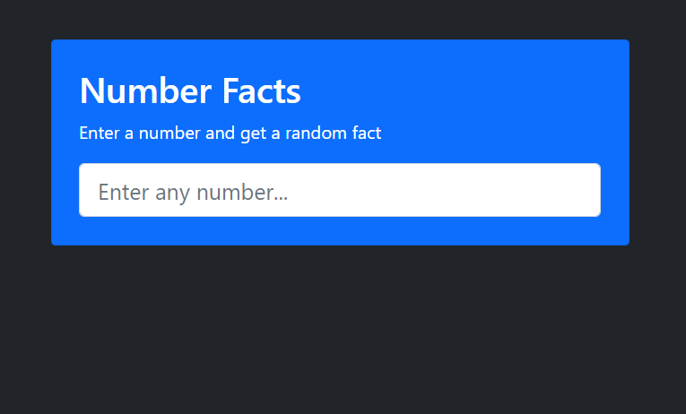
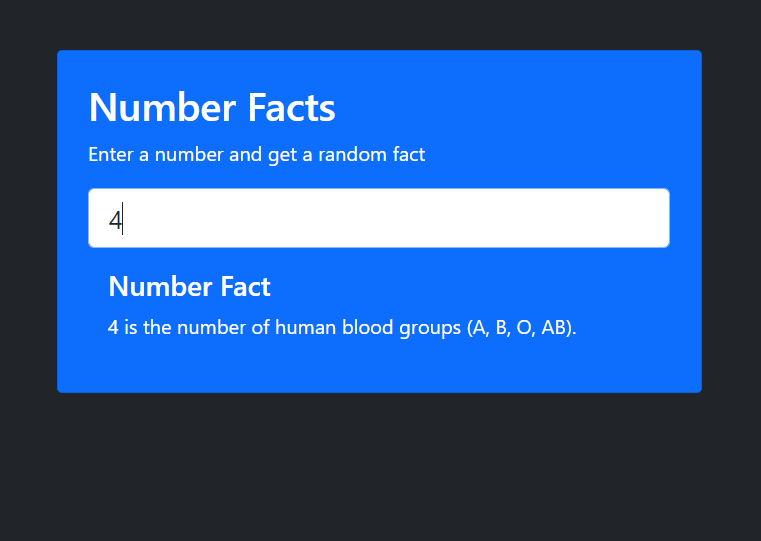

# JS-Number-Facts-App

JavaScript Number Facts Ajax & Fetch API

<!-- Live link to deployed app -->

Repository: https://github.com/Mdudzik92/JS-Number-Facts-App 
Deployed app: https://mdudzik92.github.io/JS-Number-Facts-App/

<!-- Technologies used -->

HTML, JavaScript, Ajax, Fetch API

<!-- Explanation of what the app is -->

This is an app which a user can add a number to the number input and a random fact about that number will be displayed below. Any number works, give it a try!

<!-- Screenshot -->

<!-- License -->

MIT

<!-- Contact information -->

Email: mdudzik92@gmail.com
